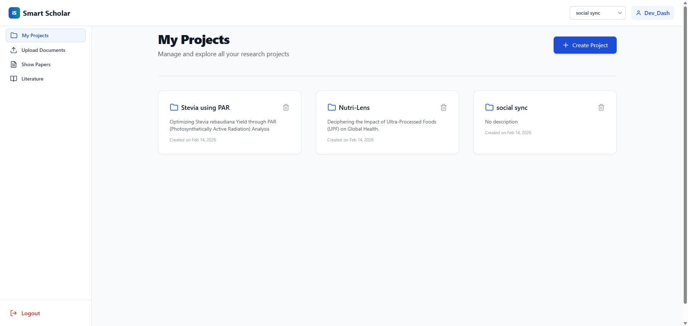
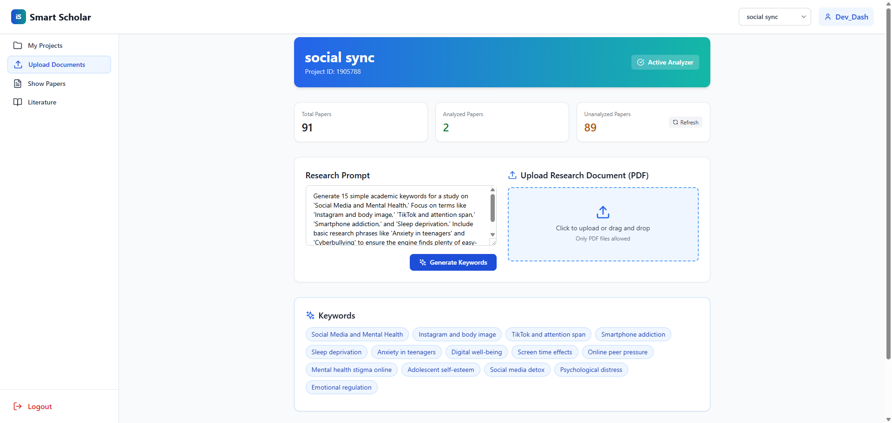
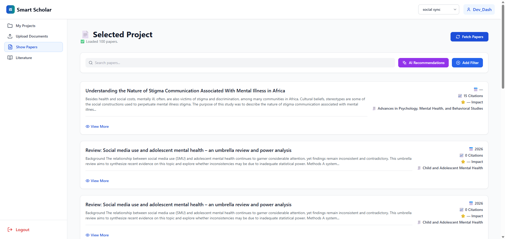
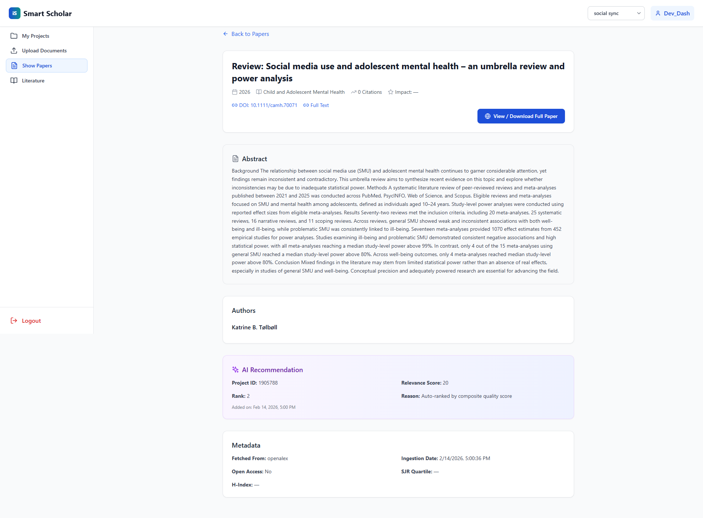
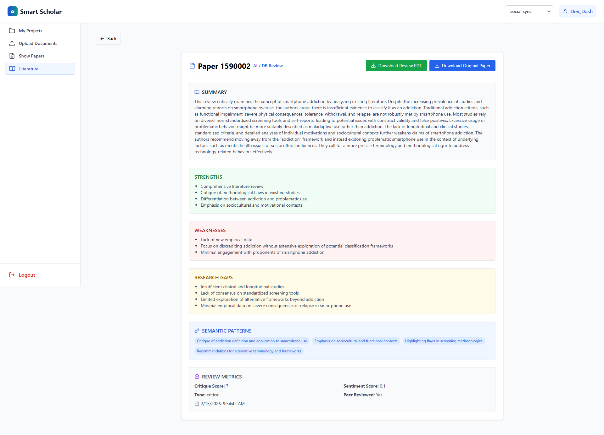

# 🧠 i-Smart ScholAR

*An AI-powered web application for smarter academic research and literature review*

**🚀 Built for Dev_dash 2026 Hackathon**

---

## 📘 Overview

**i-Smart ScholAR** is an intelligent academic assistant that helps researchers and students **discover, analyze, and summarize** research papers using AI.
It integrates **Azure OpenAI (GPT-4o)** and **LangChain** to automate research workflows — from **keyword generation** to **literature review synthesis** — all within an interactive web app.

---

## ⚡ Key Features

* ✅ AI-based **keyword generation** from prompts or PDFs
* ✅ **Smart paper discovery & ranking** by relevance
* ✅ **Instant summaries and insights** using Azure OpenAI
* ✅ **Automated literature review** with GPT-4o
* ✅ **Report export** in Markdown or PDF
* ✅ Modern and responsive web interface

---

## 🧠 Core Technologies

| Layer                   | Tools / Frameworks                  |
| ----------------------- | ----------------------------------- |
| 💻 **Frontend**         | React.js, Vite, TailwindCSS         |
| ⚙️ **Backend**          | FastAPI, LangChain                  |
| 🧩 **AI Models / APIs** | Azure OpenAI (GPT-4o)               |
| 🗄️ **Database**        | MySQL                               |
| 🌐 **External API**     | OpenAlex (for research papers)      |

---

## 🏗️ System Architecture


**Flow:**

1. React frontend interacts with FastAPI backend via REST.
2. Backend integrates:

   * 🧠 **Azure OpenAI** → Summarization, literature synthesis, and keyword generation
   * 🔗 **LangChain** → Chaining and context handling
   * 🗄️ **MySQL** → Project data and metadata storage

---

## 🧩 Core Modules

### 1️⃣ Project Dashboard


Manage and view all your research projects in a centralized list. Easily create, edit, and switch between different research topics.

---

### 2️⃣ Keyword Discovery


Generate research keywords and explore in-project tools that help you identify the best search terms for your literature.

---

### 3️⃣ Paper Collection


Access the full list of discovered research papers. Each paper is automatically ranked and categorized for easier management.

---

### 4️⃣ Paper Insights


Explore the individual details of each paper. This view provides AI-extracted summaries, key findings, and detailed metadata to help you understand the paper's core contributions at a glance.

---

### 5️⃣ Literature Review & Analysis


Synthesize your research into a professional review. This module automatically analyzes uploaded papers to identify **key insights**, **strengths**, and **weaknesses**, streamlining the academic synthesis process.

---

## ⚙️ Setup Guide

### 🧩 Prerequisites

* 🐍 Python **3.9+**
* 🧱 Node.js **18+**
* 🐬 MySQL installed and running

---

### 🔐 Environment Variables

Create a `.env` file in the **backend** directory.

**Backend `.env`:**

```env
# Azure OpenAI Configuration
AZURE_OPENAI_API_KEY=your_api_key
AZURE_OPENAI_ENDPOINT=your_endpoint_url
AZURE_OPENAI_API_VERSION=your_api_version
```

**Frontend `.env`:**

```env
VITE_BACKEND_URL=http://localhost:8000
```

---

## 🚀 Running Locally

### 1) Backend (FastAPI)

```bash
cd backend
pip install -r requirements.txt
uvicorn main:app --reload
```

* FastAPI will start at: **[http://localhost:8000](http://localhost:8000)**
* Docs: **[http://localhost:8000/docs](http://localhost:8000/docs)**

### 2) Frontend (React + Vite)

```bash
cd frontend
npm install
npm run dev
```

* Vite dev server runs at (default): **[http://localhost:5173](http://localhost:5173)**

---

## 🙌 Acknowledgements

* **Dev_dash 2026 Hackathon** for the opportunity to innovate
* **Azure OpenAI** for powerful language modeling
* **LangChain** for robust AI application development
* **FastAPI** & **React** for the modern stack

---

## 📄 License

This project is licensed under the [MIT License](./LICENSE).

---
